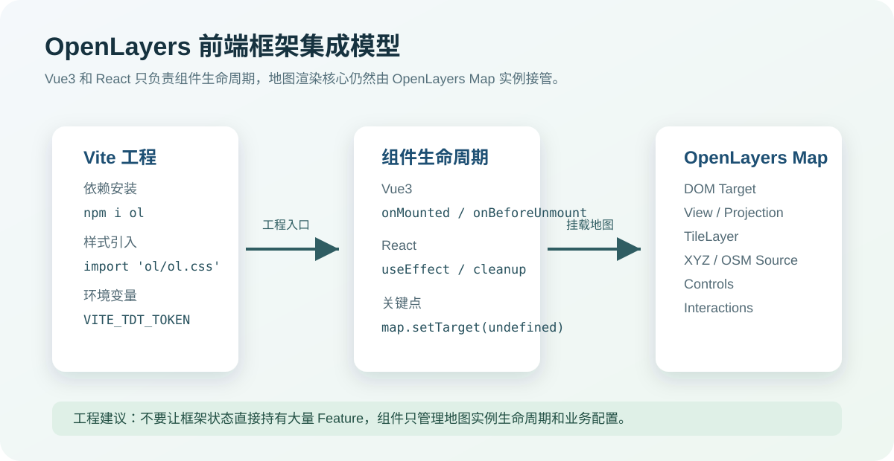
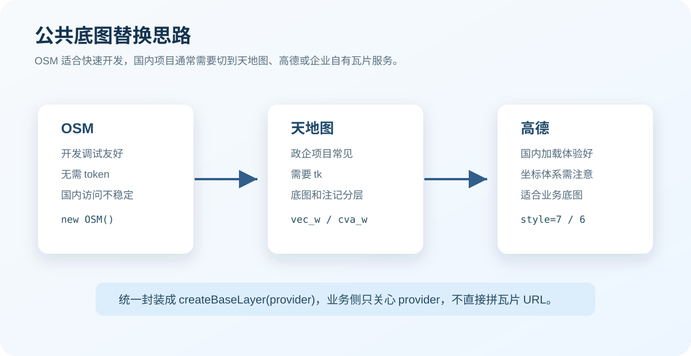
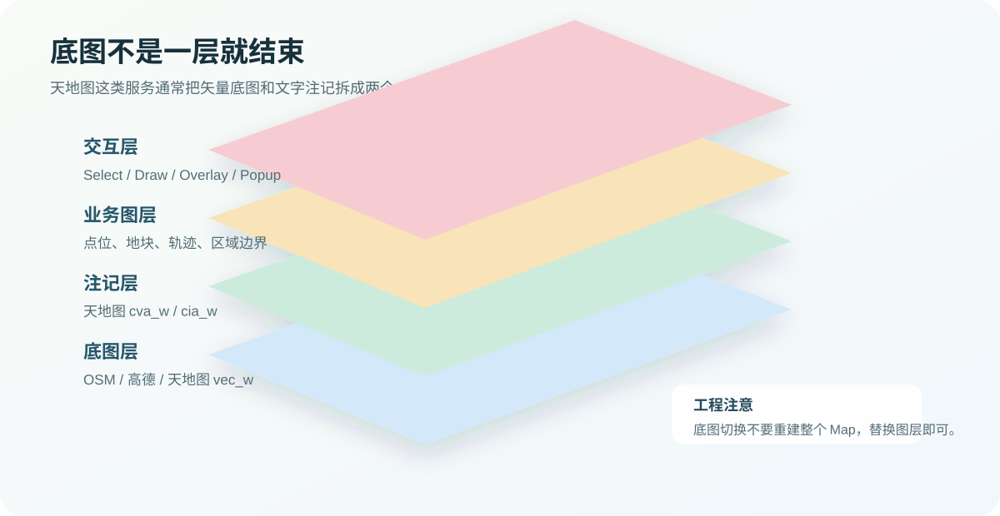

# OpenLayers 环境搭建进阶：Vue3/Vite、React 集成与国内公共底图替换实战

上一篇我们把地图跑起来了，通常是一个 OSM 底图加一个 `new Map()`。这一步很重要，但放到真实项目里还不够。

实际项目里，前端地图页面一般会马上遇到三个问题：

- Vue3 / React 组件生命周期怎么和 OpenLayers Map 实例配合
- OSM 底图在国内访问不稳定，怎么换成天地图、高德这类公共底图
- 底图切换、token、图层释放这些细节怎么组织，后面才不容易失控

这篇文章就围绕这些问题展开。它不是再写一个“Hello OpenLayers”，而是把环境搭建往工程化方向推进一步。

配套代码已经放在：

```txt
examples/02-openlayers-env-advanced/
```

配图资源在：

```txt
assets/images/02-openlayers-env-advanced/
```



## 这篇文章要解决什么

OpenLayers 和 Vue、React 的关系，很多新手一开始会理解错。

Vue 和 React 并不会接管地图内部渲染。它们负责的是页面结构、状态和生命周期；真正负责地图视图、瓦片加载、图层渲染、交互事件的是 OpenLayers 自己。

也就是说，框架组件只需要做好几件事：

- 准备一个真实 DOM 容器
- 在组件挂载后创建 `Map`
- 在组件卸载时释放 `Map`
- 把底图、业务图层、交互能力封装成可维护的模块

这个边界如果没想清楚，后面很容易把 Feature 数组、图层实例、业务状态全部塞进 Vue 或 React 状态里。小 demo 能跑，真实项目会越来越难维护。

## Vite 项目里安装 OpenLayers

无论 Vue3 还是 React，Vite 集成 OpenLayers 的基础依赖都很简单：

```bash
npm install ol
```

OpenLayers 的样式需要显式引入：

```ts
import 'ol/ol.css';
```

如果你使用天地图，还建议把 token 放到环境变量里：

```env
VITE_TDT_TOKEN=你的天地图tk
```

注意，前端环境变量最终会进入浏览器环境，不适合放高权限密钥。天地图这种浏览器端瓦片访问 token 可以这样配置，但企业项目里如果涉及内部服务鉴权，最好通过后端代理或网关处理。

## Vue3 + Vite 集成 OpenLayers

Vue3 里最稳的方式是：用 `ref` 拿到地图容器，在 `onMounted` 里创建 Map，在 `onBeforeUnmount` 里释放。

核心代码如下：

```vue
<script setup lang="ts">
import 'ol/ol.css';
import Map from 'ol/Map';
import View from 'ol/View';
import { fromLonLat } from 'ol/proj';
import { onBeforeUnmount, onMounted, ref } from 'vue';

const mapRef = ref<HTMLDivElement | null>(null);
let map: Map | null = null;

onMounted(() => {
  if (!mapRef.value) return;

  map = new Map({
    target: mapRef.value,
    layers: [],
    view: new View({
      center: fromLonLat([116.397428, 39.90923]),
      zoom: 11,
    }),
  });
});

onBeforeUnmount(() => {
  map?.setTarget(undefined);
  map = null;
});
</script>

<template>
  <section ref="mapRef" class="map"></section>
</template>
```

这里有两个细节很重要。

`target` 必须是组件挂载后的 DOM。不要在模块顶层直接创建 Map，也不要假设 `document.getElementById` 一定能拿到容器。

卸载时要调用 `map.setTarget(undefined)`。OpenLayers 会绑定 DOM、监听事件、管理渲染循环。如果组件切换频繁但不释放，内存和事件监听迟早会堆起来。

完整 Vue3 示例在：

```txt
examples/02-openlayers-env-advanced/vue3-vite/
```

## React + Vite 集成 OpenLayers

React 里对应的是 `useRef` 和 `useEffect`。

```tsx
import 'ol/ol.css';
import Map from 'ol/Map';
import View from 'ol/View';
import { fromLonLat } from 'ol/proj';
import { useEffect, useRef } from 'react';

export default function App() {
  const mapElementRef = useRef<HTMLDivElement | null>(null);
  const mapRef = useRef<Map | null>(null);

  useEffect(() => {
    if (!mapElementRef.current) return;

    mapRef.current = new Map({
      target: mapElementRef.current,
      layers: [],
      view: new View({
        center: fromLonLat([116.397428, 39.90923]),
        zoom: 11,
      }),
    });

    return () => {
      mapRef.current?.setTarget(undefined);
      mapRef.current = null;
    };
  }, []);

  return <section ref={mapElementRef} className="map" />;
}
```

React 示例有一个实际项目里很容易踩的点：不要把 `Map` 实例放进 `useState`。

`Map` 是一个复杂对象，内部有图层集合、事件系统、渲染状态。它不适合作为 React 的响应式状态参与重复渲染。更合理的做法是用 `useRef` 保存实例，再用普通函数操作地图。

完整 React 示例在：

```txt
examples/02-openlayers-env-advanced/react-vite/
```

## 为什么不能一直用 OSM 底图

OSM 很适合学习和快速验证。它无需 token，代码也最简单：

```ts
import TileLayer from 'ol/layer/Tile';
import OSM from 'ol/source/OSM';

const osmLayer = new TileLayer({
  source: new OSM(),
});
```

但在国内业务项目里，一直使用 OSM 通常会有几个问题：

- 访问速度和稳定性不可控
- 中文注记体验不一定符合业务预期
- 政企项目可能要求使用指定地图服务
- 坐标体系、瓦片来源和合规要求需要提前确认

所以环境搭建阶段就应该知道：底图不是写死的，它应该被封装成可替换能力。



## 统一封装底图工厂

示例代码把 OSM、天地图、高德统一封装到了一个工厂函数里：

```txt
examples/02-openlayers-env-advanced/shared/baseLayers.ts
```

核心类型是：

```ts
export type BaseLayerProvider =
  | 'osm'
  | 'tianditu-vector'
  | 'tianditu-image'
  | 'amap-vector'
  | 'amap-image';
```

业务侧只需要关心 `provider`，不用到处拼瓦片 URL：

```ts
const group = createBaseLayers('amap-vector');

group.layers.forEach((layer) => {
  layer.set('role', 'base');
  map.addLayer(layer);
});
```

这里返回的是 `BaseLayerGroup`，不是单个 Layer。原因很简单：有些底图不是一层。

比如天地图矢量底图通常需要：

- `vec_w`：矢量底图
- `cva_w`：中文注记

影像底图通常需要：

- `img_w`：影像底图
- `cia_w`：影像注记



## 接入天地图

天地图使用 `XYZ` 数据源即可接入。

```ts
import TileLayer from 'ol/layer/Tile';
import XYZ from 'ol/source/XYZ';

const token = import.meta.env.VITE_TDT_TOKEN;

const tiandituVectorLayer = new TileLayer({
  source: new XYZ({
    url: `https://t0.tianditu.gov.cn/DataServer?T=vec_w&x={x}&y={y}&l={z}&tk=${token}`,
    crossOrigin: 'anonymous',
    maxZoom: 18,
  }),
});
```

真实项目里一般不会只写 `t0`，而是配置多个子域名：

```ts
const urls = ['0', '1', '2', '3', '4', '5', '6', '7'].map(
  (subdomain) =>
    `https://t${subdomain}.tianditu.gov.cn/DataServer?T=vec_w&x={x}&y={y}&l={z}&tk=${token}`,
);

const layer = new TileLayer({
  source: new XYZ({
    urls,
    crossOrigin: 'anonymous',
    maxZoom: 18,
  }),
});
```

如果要显示中文注记，再叠加一个 `cva_w` 图层：

```ts
const labelLayer = new TileLayer({
  source: new XYZ({
    urls: ['0', '1', '2', '3', '4', '5', '6', '7'].map(
      (subdomain) =>
        `https://t${subdomain}.tianditu.gov.cn/DataServer?T=cva_w&x={x}&y={y}&l={z}&tk=${token}`,
    ),
    crossOrigin: 'anonymous',
    maxZoom: 18,
  }),
});
```

这里需要特别注意：天地图 token 不要直接写死在源码里。至少放到 `.env.local`，并且不要提交到仓库。

## 接入高德底图

高德瓦片也可以通过 `XYZ` 接入：

```ts
import TileLayer from 'ol/layer/Tile';
import XYZ from 'ol/source/XYZ';

const amapVectorLayer = new TileLayer({
  source: new XYZ({
    url: 'https://webrd04.is.autonavi.com/appmaptile?lang=zh_cn&size=1&scale=1&style=7&x={x}&y={y}&z={z}',
    crossOrigin: 'anonymous',
    maxZoom: 18,
  }),
});
```

常见的 `style`：

| style | 含义 |
| --- | --- |
| `7` | 矢量道路图 |
| `6` | 影像底图 |

高德底图在国内加载体验通常比较好，但企业项目里要特别关注坐标问题。高德使用 GCJ02 坐标体系，而 OpenLayers 默认很多示例都按 EPSG:3857 / WGS84 处理。只是加载底图时问题不明显，一旦你叠加业务点位、轨迹、行政区边界，偏移问题就会出现。

所以后面的坐标系专题会专门讲 GCJ02、WGS84、EPSG:3857 之间的转换关系。

## 底图切换不要重建整个 Map

很多人做底图切换时，会直接销毁 Map 再创建一个新的 Map。

这在 demo 里没什么感觉，但真实项目里代价很高：业务图层、交互状态、弹窗、绘制工具、当前视图范围都可能被重置。

更合适的方式是给底图图层打标记：

```ts
layer.set('role', 'base');
```

切换时只移除旧底图：

```ts
const oldBaseLayers = map
  .getLayers()
  .getArray()
  .filter((layer) => layer.get('role') === 'base');

oldBaseLayers.forEach((layer) => map.removeLayer(layer));
```

再把新的底图组加进去：

```ts
const group = createBaseLayers('tianditu-vector', {
  tiandituToken: import.meta.env.VITE_TDT_TOKEN,
});

group.layers.forEach((layer) => {
  layer.set('role', 'base');
  map.addLayer(layer);
});
```

这种做法的好处是：View 不动，业务图层不动，交互状态也不动。底图只是地图图层栈里的基础层。

## 目录结构建议

如果只是学习，一个 `App.vue` 或 `App.tsx` 当然可以写完。

但项目一旦要继续扩展，我建议从一开始就把底图能力抽出去：

```txt
src/
├── map/
│   ├── baseLayers.ts
│   ├── createMap.ts
│   ├── mapOptions.ts
│   └── types.ts
├── components/
│   └── MapView.vue
└── pages/
    └── DemoPage.vue
```

React 项目也类似：

```txt
src/
├── map/
│   ├── baseLayers.ts
│   ├── createMap.ts
│   └── types.ts
├── components/
│   └── MapView.tsx
└── pages/
    └── DemoPage.tsx
```

核心思路是：组件负责生命周期，`map/` 目录负责 OpenLayers 能力封装。

这样后面继续加图层管理、绘制工具、Overlay、轨迹回放时，项目不会变成一整个巨大的地图组件。

## 常见问题

### 1. 地图容器为什么是空白

先检查容器高度。

OpenLayers 不会自动撑开容器，如果 `.map` 没有高度，地图就是空白：

```css
html,
body,
#app {
  height: 100%;
  margin: 0;
}

.map {
  height: 100%;
}
```

React 项目里把 `#app` 换成 `#root`。

### 2. 为什么天地图加载不出来

优先检查三个点：

- `VITE_TDT_TOKEN` 是否配置
- URL 里的 `tk` 是否真的带上了
- 浏览器 Network 面板里瓦片请求是否返回错误

如果 token 没配置，示例里的 `createBaseLayers` 会直接抛错，这是故意的。真实项目里早点暴露配置问题，比静默空白要好排查得多。

### 3. 为什么高德底图和业务点位偏移

这通常不是 OpenLayers 初始化问题，而是坐标系问题。

高德底图使用 GCJ02，很多后端业务数据可能是 WGS84 或已经转成 EPSG:3857。坐标系不统一时，点位就会偏。

实际项目里要先确认：

- 后端返回的是 WGS84、GCJ02 还是 BD09
- 前端展示底图使用什么坐标体系
- 是否需要在入库、接口层或前端渲染前统一转换

### 4. Vue 或 React 热更新后地图重复渲染

检查组件卸载时有没有调用：

```ts
map.setTarget(undefined);
```

另外，不要在组件每次渲染时都重新 `new Map()`。地图实例应该只在容器首次可用时创建。

## 工程建议

OpenLayers 环境搭建进阶，本质上不是多写几行配置，而是提前把地图工程的边界划清楚。

我的建议是：

- 学习阶段可以用 OSM，业务项目尽早接入真实底图
- Vue3 / React 只管理地图容器和生命周期，不要接管 OpenLayers 内部状态
- 底图服务统一封装，避免 URL 散落在页面组件里
- 天地图注记层、影像层、矢量层要按图层组理解
- 高德底图要提前考虑 GCJ02 坐标偏移问题
- 底图切换只替换 TileLayer，不要重建整个 Map

把这些基础打好，后面讲图层管理、坐标系、海量点位优化时，代码结构会舒服很多。

下一篇可以继续往下走：OpenLayers 五大核心对象到底是什么，以及它们在真实 GIS 页面里分别承担什么职责。
